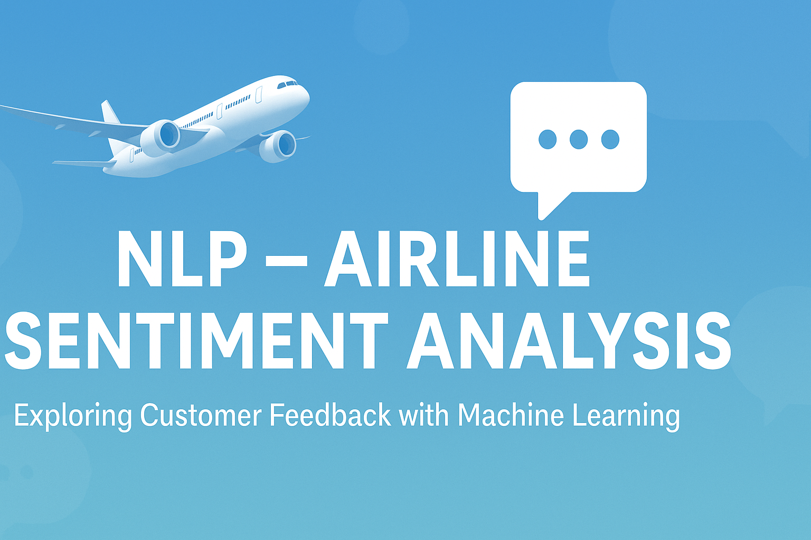

# ✈️ NLP – Airline Sentiment Analysis  

  

---

## 📌 Project Overview  
This project explores customer sentiments from Twitter data related to airlines. Using **Natural Language Processing (NLP)**, **Exploratory Data Analysis (EDA)**, and **Machine Learning models**, the study uncovers how customers feel (positive, negative, or neutral) and identifies key drivers behind negative sentiments.  

The analysis provides insights to help airlines improve customer satisfaction and guide strategic business decisions.  

---

## 🎯 Objectives  
- Perform **EDA** to detect patterns, anomalies, and sentiment distribution.  
- Apply **NLP techniques** to preprocess and analyze text data.  
- Build and evaluate **sentiment classification models**.  
- Provide **business recommendations** for improving customer service.  

---

## 📊 Dataset  
The dataset consists of **Twitter data** capturing airline passenger feedback. It includes:  
- Tweet ID & text  
- Sentiment (positive, negative, neutral)  
- Sentiment confidence score  
- Airline names  
- Reasons for negative tweets  
- User metadata (location, timezone, coordinates, timestamp)  

---

## 🧑‍💻 Methodology  
1. **Data Preprocessing** – Cleaning tweets, tokenization, stopword removal.  
2. **EDA** – Visualizing sentiment distribution across airlines.  
3. **Feature Engineering** – TF-IDF vectors, word embeddings.  
4. **Modeling** – Logistic Regression, Naive Bayes, Random Forest, and Neural Networks.  
5. **Evaluation** – Accuracy, precision, recall, F1 score.  
6. **Visualization** – Word clouds, sentiment comparison charts, airline-level breakdowns.  

---

## 📈 Key Insights  
- Majority of tweets expressed **negative sentiments**.  
- Certain airlines consistently showed **higher negative ratios**, highlighting service quality issues.  
- Neutral sentiments were common, offering opportunities to convert them into positive experiences.  
- Positive tweets highlighted punctual flights, staff friendliness, and good service.  

---

## 🛠️ Tools & Technologies  
- **Languages**: Python (pandas, NumPy, scikit-learn, NLTK, spaCy)  
- **Visualization**: matplotlib, seaborn, wordcloud  
- **Machine Learning**: Logistic Regression, Naive Bayes, Random Forest, Neural Networks  
- **Deliverables**: Jupyter Notebook, HTML Export, Presentation, PDF Report  

---

## 📥 Deliverables  

📘 [Download Full Project Report (PDF)](./Natural%20Language%20Processing.pdf)  
📊 [View Presentation (PPTX)](./Natural%20Language%20Processing.pptx)  
📓 [Run Jupyter Notebook (.ipynb)](./NLP_Sentiment_Analysis_%5BSolution%5D.ipynb)  
🌐 [View Notebook in HTML](./NLP_Sentiment_Analysis_%5BSolution%5D.html)  

---

## ✅ Outcome  
- Delivered a **comprehensive sentiment analysis** of airline customer feedback.  
- Identified **pain points** from customer complaints and service dissatisfaction.  
- Provided **data-driven recommendations** to improve airline customer experience.  
- Demonstrated the **value of NLP and ML** in analyzing unstructured social media data.  

---

## 👥 Who Will Benefit  
- 🛫 **Airline Companies** – to track brand reputation and address service quality issues.  
- 📊 **Marketing Teams** – to tailor campaigns based on customer sentiment.  
- 🎓 **Researchers** – to study sentiment analysis and NLP applications.  
- 🧑‍💻 **Data Science Practitioners** – as a case study for NLP in real-world datasets.  
- 👥 **Passengers/Customers** – indirectly benefit through improved airline services.  

---

## 🚀 Future Work  
- Apply **transformer models (BERT, RoBERTa)** for more accurate classification.  
- Expand dataset beyond airlines to cover broader travel & hospitality domains.  
- Deploy a **real-time sentiment dashboard** for continuous monitoring.  

---

## 👥 Contributors  
Group 10 – Submitted for **DAB 303: Marketing Analytics** under **Dr. Andreas S. Maniatis**  

---

✨ *This repository showcases how NLP can turn unstructured social media conversations into actionable business insights for the airline industry.*  
